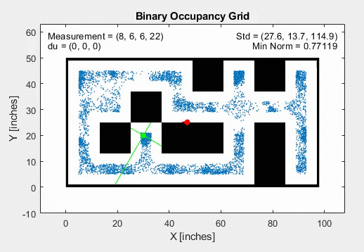
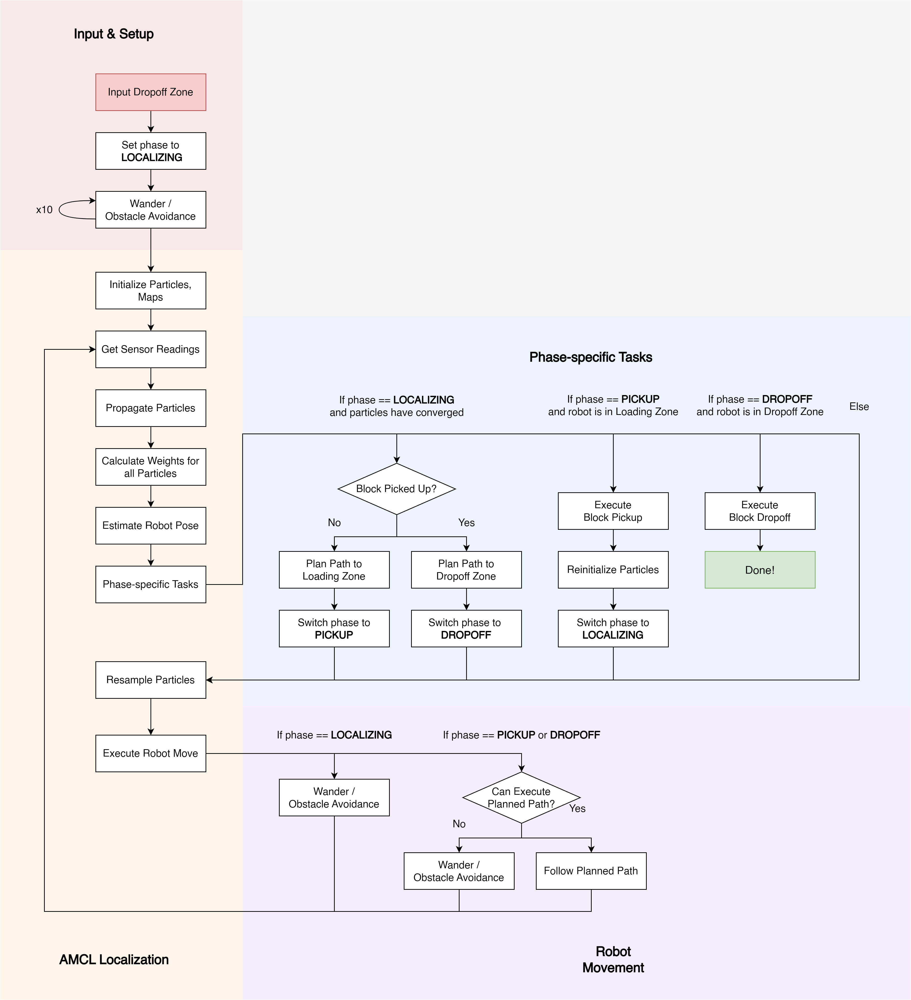

# lightning-mcqueen

Autonomous navigation system including:
- Custom-built Adaptive Monte Carlo Localization (AMCL)
- A* path planning
- Obstacle avoidance

Built 3 modes: MATLAB testing simulator, TCP/IP simulator, and physical robot

# Demo

# Flow Diagram

